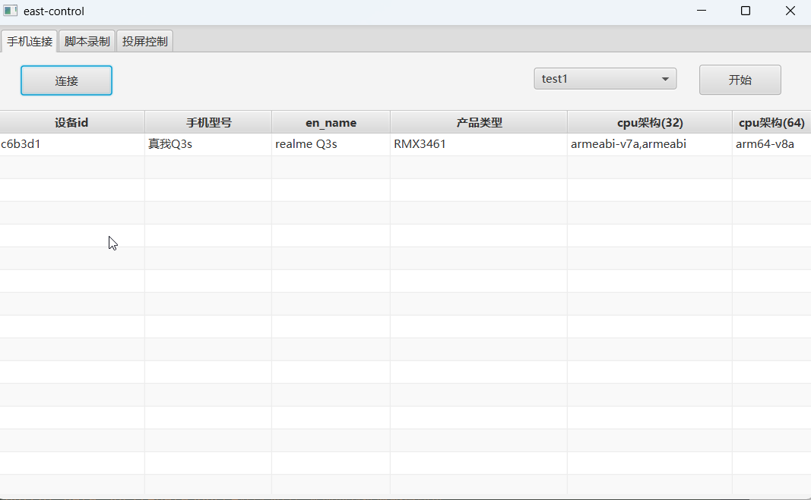

# east-control
> javafx+jdk21编写的基于adb的手机群控软件，支持自定义组合执行流程，内置多种事件。

## 界面


## 运行前准备
```bash
1.本机安装ADB,配置到环境变量中
2.手机通过usb连接到电脑,打开开发者模式
3.手机连接电脑后选择stdio
```

## 使用
```bash
#1.创建数据库（或直接复制仓库中的即可）
sqlite3 east-control
#2.导入sql(使用可视化工具或者命令均可)
#3.修改连接配置
打开com.east.control.data.SQLiteDataSource修改为自己本地的数据库路径即可
#4.配置jdk21环境+maven运行即可
```
